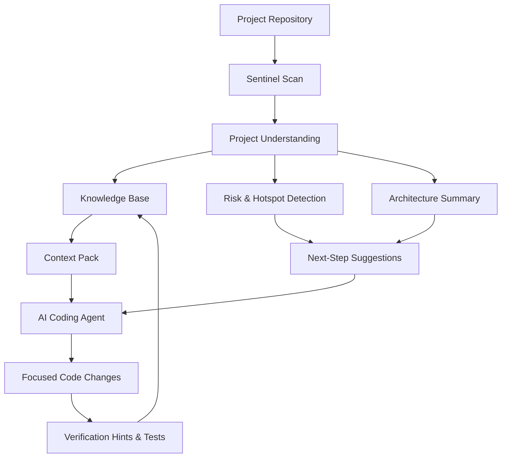
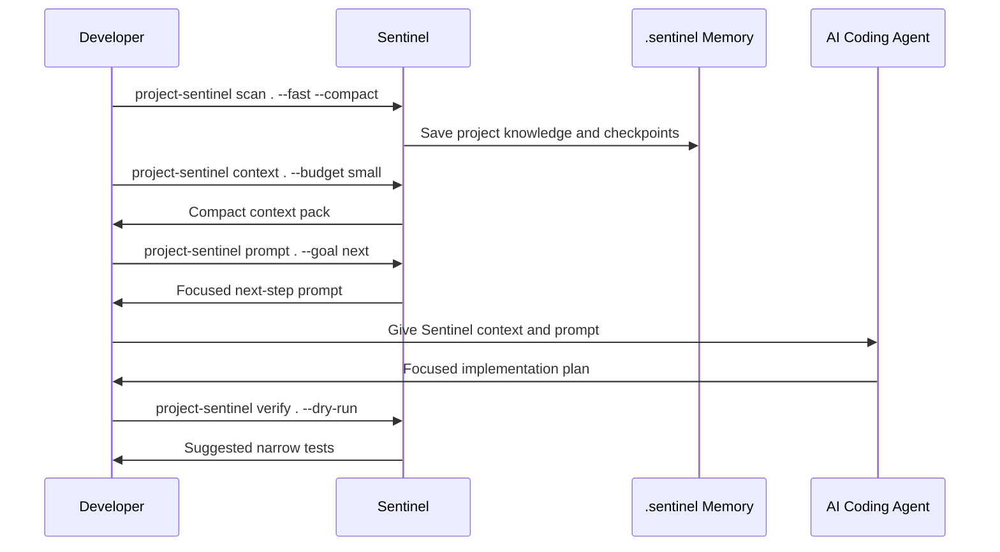

# Project Sentinel Agent

**Sentinel** is a project-aware CLI for AI-assisted development.

It scans a codebase, understands how the project is organised, stores persistent knowledge, and recommends the next highest-value action to take.

Instead of forcing an AI agent to rediscover the same repository every session, Sentinel gives it a compact project memory layer with:

- Architecture overview
- Important files
- Entry points
- Hotspots
- Risks
- Test hints
- Next-step suggestions
- Agent-ready context packs

By default, Sentinel stores its runtime state inside the scanned project:

```text
.sentinel/
```

This makes Sentinel easy to use as:

- A standalone CLI
- A vendored tool inside another repository
- A project memory layer for AI coding agents
- A local assistant for engineering audits and reports

---

## Why Sentinel Exists

Modern AI coding agents are powerful, but they can waste a lot of time and context by repeatedly reading the same repository from scratch.

Sentinel solves this by creating a persistent, structured memory of the project.

Instead of giving an AI agent the whole repository, Sentinel gives it the right context first.

```text
Without Sentinel:

AI Agent
  ↓
Reads many files manually
  ↓
Uses lots of tokens
  ↓
May miss risks or important files
  ↓
Guesses the next action


With Sentinel:

Sentinel scans project
  ↓
Builds project memory
  ↓
Ranks risks and focus files
  ↓
Creates compact context
  ↓
AI Agent starts with better direction
```

Sentinel is not just another dashboard.

It is an operating layer for agentic development:

```text
Small context in.
Focused action out.
Clear verification path.
```

---

## Core Idea



Sentinel helps developers and AI agents answer:

- What is this project?
- Where should I start?
- Which files matter most?
- What is risky?
- What should be fixed next?
- How should changes be verified?
- What context should an AI agent receive?

---

## Before vs After Sentinel

| Area | Without Sentinel | With Sentinel |
|---|---|---|
| Project understanding | The AI agent manually reads many files | Sentinel generates a compact project overview |
| Token usage | Large parts of the repo may be loaded repeatedly | Only relevant files and summaries are provided |
| Onboarding | Developers explain structure manually | Sentinel identifies architecture, entry points, tests, and hotspots |
| Next action | The agent may guess what to do next | Sentinel ranks the highest-value next action |
| Risk awareness | High-risk files may be missed | Sentinel highlights risky files and hotspots |
| Testing | Test selection may be broad or unclear | Sentinel suggests focused verification commands |
| Agent safety | The agent may edit without enough context | Sentinel provides validated focus files |
| Project memory | Every session starts almost from zero | Sentinel stores knowledge, checkpoints, and reports |
| Documentation | Reports are written manually | Sentinel generates terminal and markdown reports |
| Kilo / Cline / Codex workflow | Context must be prepared manually | Sentinel generates agent-ready prompts and context packs |

---

## Why Teams Use Sentinel

Use Sentinel when you want:

- **Less context waste**  
  Start from a small, ranked project brief instead of dumping the whole repository into an LLM.

- **Faster onboarding**  
  Understand architecture, entry points, tests, hotspots, and workflow in one command.

- **Better engineering judgement**  
  Get suggestions backed by files, audit findings, confidence, impact, effort, and verification hints.

- **Safer agent work**  
  Point Codex, Kilo, Cline, Claude Code, Roo, or Continue at validated focus files and narrow test commands.

- **Durable project memory**  
  Keep scan history, checkpoints, reports, task memory, and token-saving history inside `.sentinel/`.

- **Vendor-friendly adoption**  
  Drop Sentinel into `tools/sentinel`, install it editable, or run it as a standalone CLI.

---

## Main Features

Sentinel includes:

- Project scanning
- Codebase auditing
- Architecture summarisation
- Persistent knowledge storage
- Checkpoint tracking between scans
- Prioritised next-step suggestions
- Suggestion confidence scoring
- Impact and effort labels
- Verification hints
- Risk scoring for high-impact files
- Documentation drift detection
- Low-token context packs
- Agent prompt generation
- Kilo file bridge output
- Stale context detection
- Markdown report generation
- Terminal reports
- Local live dashboard
- PR summary generation
- Coverage hotspot analysis
- Release-readiness checks
- MCP health checks
- Autofix planning
- Stale report cleanup
- Continuous project monitoring
- Python AST symbol indexing
- Import graph generation
- Call graph generation
- Dependency hotspot detection
- Runtime path analysis
- Task memory recording
- Token-saving timeline
- Adapter prompts for Cline, Claude Code, Codex, Roo, and Continue
- Standard-library-only Python implementation

---

## Quick Start

Install Sentinel locally:

```bash
python -m pip install -e .
```

Scan a project:

```bash
project-sentinel scan /path/to/project --fast --compact
```

Or run directly from a checkout:

```bash
python sentinel.py scan . --fast --compact
```

Generate a tiny AI-friendly summary:

```bash
python sentinel.py brief /path/to/project --fast --quiet
```

Generate a project overview:

```bash
python sentinel.py overview /path/to/project --fast
```

Generate a compact context pack:

```bash
python sentinel.py context /path/to/project --budget small --fast
```

Generate a focused next-step prompt:

```bash
python sentinel.py prompt /path/to/project --goal next --budget small --fast
```

Open the local dashboard:

```bash
python sentinel.py dashboard /path/to/project --port 8765 --fast
```

Watch a project continuously:

```bash
python sentinel.py watch /path/to/project --interval 30
```

Generate a full report:

```bash
python sentinel.py report /path/to/project
```

---

## Recommended AI Agent Workflow

Use this workflow before starting a task with an AI coding agent:

```bash
project-sentinel overview . --fast --quiet
project-sentinel context . --budget small --fast --quiet
project-sentinel prompt . --goal next --budget small --fast --quiet
```

This gives the agent:

1. A clear project overview
2. A compact context pack
3. A focused next-step prompt
4. A list of files to inspect first
5. A better verification path

The goal is to stop the agent from reading the repository blindly.

---

## Example Workflow



---

## Proof of Value

Sentinel is designed to improve AI-assisted development in measurable ways.

| Metric | Before Sentinel | After Sentinel |
|---|---:|---:|
| Files inspected before starting | 20-50+ | 3-8 focused files |
| Time to understand project structure | 20-40 minutes | 1-3 minutes |
| AI context quality | Large and unstructured | Compact and ranked |
| Repeated repository scanning | Common | Reduced by persistent memory |
| Next-step clarity | Manual decision | Sentinel-ranked suggestion |
| Risk detection | Manual | Automated hotspot and risk signals |
| Test selection | Broad or guessed | Focused verification hints |
| Project state documentation | Manual | Auto-generated reports |
| Agent prompt quality | Generic | Project-aware and task-focused |
| Memory between sessions | Limited | Stored in `.sentinel/` |

---

## Example Sentinel Output

After running:

```bash
project-sentinel scan . --fast --compact
```

Sentinel can produce outputs such as:

```text
Project Health: Good
Main Language: Python
Detected Tests: Yes
Documentation: Present
Knowledge Base: Updated
Checkpoints: Saved

Top Suggestion:
Improve documentation coverage for high-risk modules.

Focus Files:
- src/sentinel.py
- src/auditor.py
- src/suggester.py

Verification Hint:
python -m unittest discover -s tests -v
```

After running:

```bash
project-sentinel prompt . --goal next --budget small --fast
```

Sentinel can generate an agent-ready prompt such as:

```text
You are working on this project using Sentinel context.

Goal:
Take the next highest-value action.

Start with these files:
- src/sentinel.py
- src/auditor.py
- src/suggester.py

Known risks:
- Large orchestration file
- Documentation may drift from implementation
- Some commands require focused verification

Suggested action:
Review the current CLI command structure and improve command discoverability.

Verification:
Run the related unit tests before proposing final changes.
```

---

## Project Layout

```text
src/
  sentinel.py      Main orchestrator and CLI entrypoint
  auditor.py       Scanning, auditing, and checkpoints
  knowledge.py     Persistent knowledge base
  suggester.py     Prioritized next-step suggestions
  graph.py         AST symbols, imports, calls, dependencies, and runtime paths
  verifier.py      Changed-file detection and focused test selection
  monitor.py       Continuous monitoring loop
  reporter.py      Terminal and markdown reports
  utils.py         Shared helpers and defaults

config/
  config.json
  audit_rules.json
  patterns.json

.sentinel/
  knowledge_base.json
  checkpoints.json
  reports/

tests/
  test_sentinel.py
  test_auditor.py
  test_knowledge.py

docs/
  ARCHITECTURE.md
  API.md
  USER_GUIDE.md
```

---

## Output Files

Sentinel writes project memory and reports into the scanned project.

| File | Purpose |
|---|---|
| `.sentinel/knowledge_base.json` | Stores discovered project knowledge |
| `.sentinel/checkpoints.json` | Stores scan checkpoints and diffs |
| `.sentinel/reports/` | Stores archived markdown reports |
| `SENTINEL_REPORT.md` | Full project report generated by the `report` command |
| `CONTEXT.md` | Compact context file for AI agents |
| `.sentinel/kilo/prompt.md` | Focused Kilo task prompt |
| `.sentinel/kilo/focus-files.txt` | Validated files Kilo should inspect first |
| `.sentinel/kilo/status.json` | Bridge health, freshness, and validation metadata |

---

## CLI Commands

| Command | Description |
|---|---|
| `scan` | Run a single project scan |
| `brief` | Show a tiny summary with the top suggestion |
| `overview` | Explain project structure, hotspots, and workflow |
| `context` | Emit a compact low-token context pack |
| `prompt` | Generate a focused prompt for the next step, review, debug pass, or plan |
| `retrieve` | Return query-specific files, symbols, snippets, imports, and call hints |
| `graph` | Build Python AST symbols, import graph, and call graph |
| `verify` | Run or preview focused checks for changed files |
| `memory` | Record or list task memory |
| `savings` | Show tracked estimated token savings |
| `doctor` | Validate config and runtime paths |
| `dashboard` | Serve a local live dashboard |
| `autofix` | Plan or apply small safe fixes |
| `pr` | Summarise changed files, risks, and suggested tests |
| `timeline` | Show scan history, task memory, and token savings |
| `mcp-health` | Validate MCP tool availability and file bridge freshness |
| `coverage` | Read `coverage.xml` and identify weakly covered hotspots |
| `cleanup-reports` | Mark old archived reports as historical |
| `release-check` | Run an open-source readiness checklist |
| `features` | List commands and optionally show a terminal animation |
| `adapters` | Print or write adapter prompts for AI coding tools |
| `mcp` | Run Sentinel as a stdio MCP server |
| `kilo-setup` | Create Kilo configuration and Sentinel-first rules |
| `kilo-bridge` | Set up Kilo with the no-MCP file bridge |
| `kilo-refresh` | Refresh Kilo context files before a task |
| `kilo-watch` | Keep Kilo context files refreshed continuously |
| `watch` | Continuously monitor a project |
| `report` | Save a markdown report |
| `status` | Print latest saved project status without rescanning |

---

## Useful Flags

| Flag | Purpose |
|---|---|
| `--fast` | Trades scan depth for speed |
| `--compact` | Produces shorter output |
| `--quiet` | Suppresses log noise |
| `--top 1` | Keeps only the most important suggestion |
| `--budget small` | Emits minimal context for token-sensitive workflows |
| `--budget medium` | Emits more detail while still controlling context size |
| `--format json` | Produces JSON output for scripts or automation |
| `--ignore-path` | Excludes vendored or irrelevant paths from scanning |

---

## Common Commands

Run a fast scan:

```bash
python sentinel.py scan /path/to/project --fast --compact
```

Generate a tiny summary:

```bash
python sentinel.py brief /path/to/project --fast --quiet
```

Generate a project overview:

```bash
python sentinel.py overview /path/to/project --fast
```

Generate compact context:

```bash
python sentinel.py context /path/to/project --budget small --fast
```

Generate a next-step prompt:

```bash
python sentinel.py prompt /path/to/project --goal next --budget small --fast
```

Retrieve task-specific context:

```bash
python sentinel.py retrieve /path/to/project --query "scheduler timeout bug" --goal debug --fast
```

Inspect symbols and imports:

```bash
python sentinel.py graph /path/to/project
```

Preview focused verification:

```bash
python sentinel.py verify /path/to/project --dry-run
```

Generate a report:

```bash
python sentinel.py report /path/to/project
```

Open dashboard:

```bash
python sentinel.py dashboard /path/to/project --port 8765 --fast
```

Summarise a pull request:

```bash
python sentinel.py pr /path/to/project
```

Run release checklist:

```bash
python sentinel.py release-check /path/to/project
```

Check coverage hotspots:

```bash
python sentinel.py coverage /path/to/project
```

Show latest saved status:

```bash
python sentinel.py status /path/to/project
```

Generate JSON output:

```bash
python sentinel.py scan /path/to/project --format json
```

---

## Configuration

The default configuration lives in:

```text
config/config.json
```

Supported environment variables:

| Variable | Purpose |
|---|---|
| `SENTINEL_CONFIG_PATH` | Override the config file location |
| `SENTINEL_LOG_LEVEL` | Set the log level, such as `INFO` or `DEBUG` |
| `SENTINEL_DEBUG_MODE` | Enable debug logging when set to a truthy value |
| `SENTINEL_HOME` | Override where Sentinel stores runtime state |

---

## Development

Run the test suite:

```bash
python -m unittest discover -s tests -v
```

Install as a package locally:

```bash
python -m pip install .
```

Install in editable mode:

```bash
python -m pip install -e .
```

---

## Bringing Sentinel Into Another Project

Recommended approach:

```bash
python -m pip install -e path/to/sentinel

project-sentinel overview . --fast --quiet --ignore-path tools/sentinel
project-sentinel context . --budget small --fast --quiet --ignore-path tools/sentinel
project-sentinel prompt . --goal next --budget small --fast --quiet --ignore-path tools/sentinel
```

This works well when Sentinel is copied into:

```text
tools/sentinel/
```

or:

```text
vendor/sentinel/
```

If Sentinel lives inside the same repository you are scanning, use:

```bash
--ignore-path tools/sentinel
```

This prevents Sentinel from scanning itself.

---

## Token-Saving Workflow

Sentinel is designed to reduce wasteful LLM context loading.

Use this pattern:

```bash
project-sentinel overview . --fast --quiet --ignore-path tools/sentinel
project-sentinel context . --budget small --fast --quiet --ignore-path tools/sentinel
project-sentinel prompt . --goal next --budget small --fast --quiet --ignore-path tools/sentinel
```

This gives you:

- A high-level project explanation
- A compact context pack
- A focused next-step prompt
- A small list of relevant files
- A clearer verification path

The token savings are only real if your AI agent starts from Sentinel output instead of rereading large parts of the repository from scratch.

---

## Kilo Code Integration

Sentinel can integrate with Kilo in two ways:

| Mode | Description |
|---|---|
| No-MCP file bridge | Writes compact context into normal workspace files that Kilo can read directly |
| MCP bridge | Exposes Sentinel as tools when Kilo's MCP dispatcher is working correctly |

---

## Recommended Kilo Setup

Use the no-MCP file bridge for the strongest practical setup:

```bash
project-sentinel kilo-bridge . --scan-root axiom --budget small --fast --force
```

This writes:

```text
CONTEXT.md
.sentinel/kilo/prompt.md
.sentinel/kilo/focus-files.txt
.sentinel/kilo/status.json
.kilo/kilo.jsonc
.kilo/rules/sentinel-file-bridge.md
.kilo/rules/sentinel-first.md
.kilo/agents/sentinel-code.md
.kilocode/mcp.json
.kilocode/rules/sentinel-first.md
```

Daily refresh before a Kilo task:

```bash
project-sentinel kilo-refresh . --scan-root axiom --budget small --goal next --fast
```

Then tell Kilo:

```text
Read CONTEXT.md.
Follow .sentinel/kilo/prompt.md.
Start with .sentinel/kilo/focus-files.txt.
```

Optional background refresh:

```bash
project-sentinel kilo-watch . --scan-root axiom --budget small --fast --interval 30
```

---

## Kilo Output Files

| File | Purpose |
|---|---|
| `CONTEXT.md` | Auto-readable compact project brief |
| `.sentinel/kilo/prompt.md` | Task prompt Kilo should follow |
| `.sentinel/kilo/focus-files.txt` | First files Kilo should inspect |
| `.sentinel/kilo/status.json` | Token, health, freshness, and path validation metadata |
| `.kilo/kilo.jsonc` | Modern Kilo MCP configuration |
| `.kilo/rules/sentinel-file-bridge.md` | No-MCP file bridge workflow |
| `.kilo/rules/sentinel-first.md` | Sentinel-first operating rule |
| `.kilo/agents/sentinel-code.md` | Selectable Sentinel-first Kilo agent profile |
| `.kilocode/mcp.json` | Compatibility fallback for older Kilo builds |
| `.kilocode/rules/sentinel-first.md` | Legacy Sentinel-first rule fallback |

If a focus file disappears or the scan root moves, Sentinel marks the bridge as stale and prints the exact `kilo-refresh` command needed to regenerate it.

---

## MCP Usage

Run Sentinel as an MCP server:

```bash
python sentinel.py mcp /path/to/project --budget small --fast
```

MCP uses stdio.

A healthy server may wait silently for the client to send framed MCP messages.

If started manually in a terminal, no startup banner is expected.

Press `Ctrl+C` to stop it.

Useful MCP tools include:

| Tool | Purpose |
|---|---|
| `sentinel_sentinel_context` | Provides compact project context |
| `sentinel_sentinel_overview` | Provides architecture and hotspot summary |
| `sentinel_sentinel_prompt` | Provides a focused next-step prompt |

---

## Important Limitation

Sentinel does not magically reduce token usage by itself.

Token savings happen when the AI agent actually starts from:

```text
CONTEXT.md
.sentinel/kilo/prompt.md
.sentinel/kilo/focus-files.txt
Sentinel MCP tools
```

instead of reopening large parts of the repository from scratch.

---

## Legacy Commands

Older command forms are still supported:

```bash
python sentinel.py --once
python sentinel.py /path/to/project --full-report
python sentinel.py /path/to/project --interval 30
```

---

## Summary

Sentinel gives AI coding agents memory, focus, and engineering judgement before they touch your codebase.

It helps turn this:

```text
Read everything.
Guess what matters.
Try a change.
Hope the tests are right.
```

into this:

```text
Read the project brief.
Inspect the right files.
Take the highest-value next action.
Verify with focused tests.
Store what changed.
```

Sentinel is a persistent project intelligence layer for AI-assisted software development.
