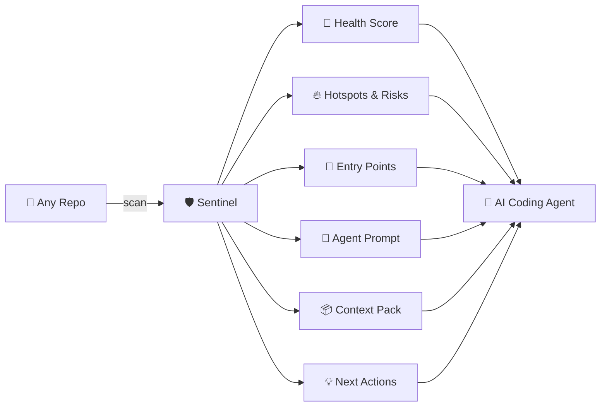
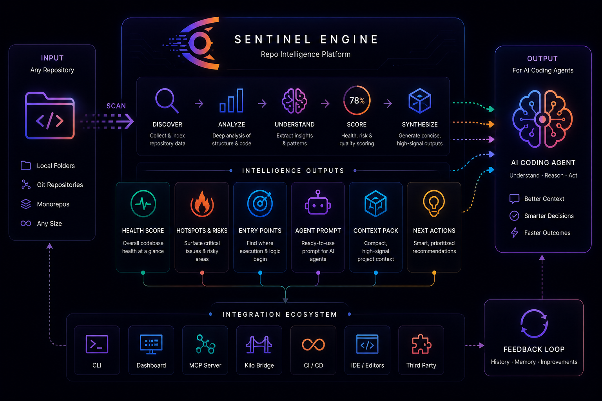
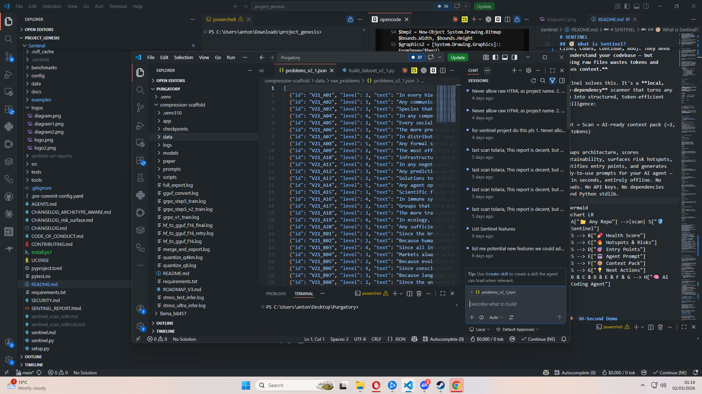
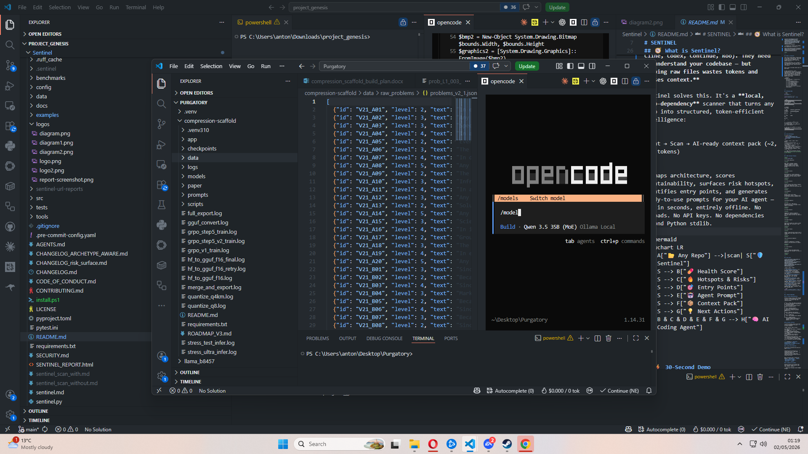
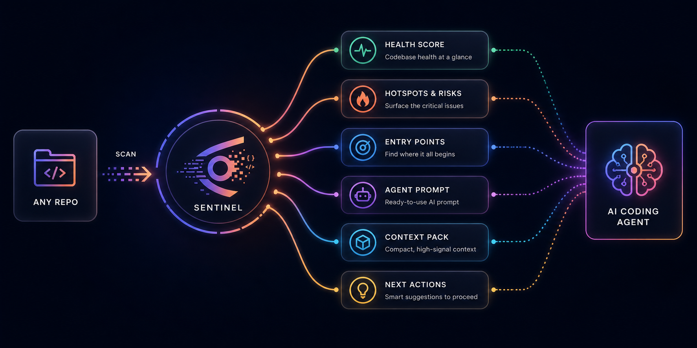
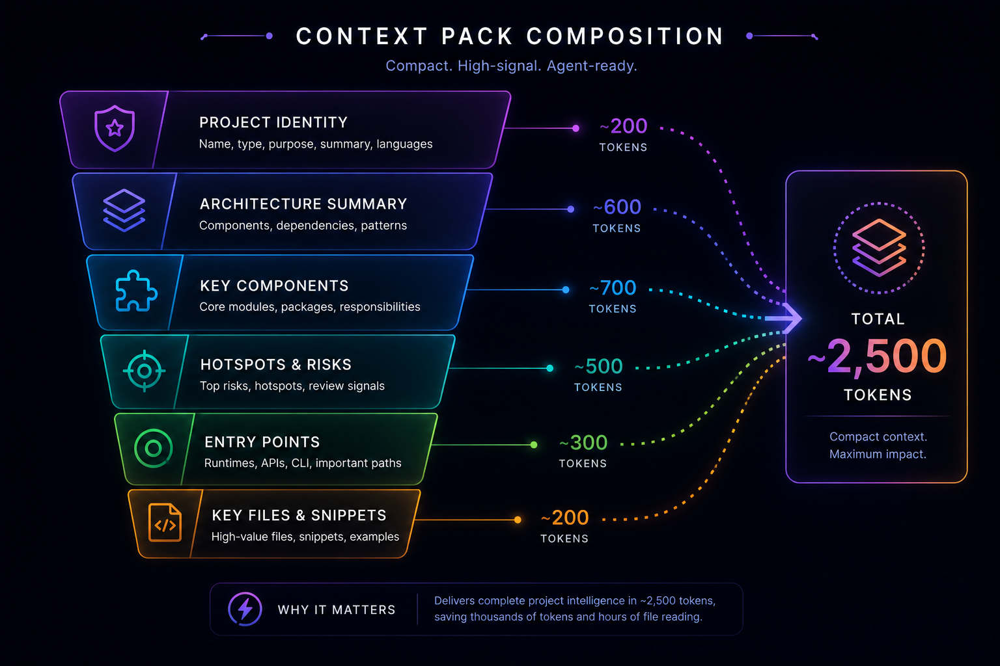

<div align="center">

<p align="center">
  
</p>

# SENTINEL

### **For developers who want AI to understand their codebase — without uploading to the cloud**

**Scan → Understand → Act**

[](https://github.com/Ntooxx/Sentinel/actions/workflows/test.yml)
[](#quick-start)
[](#quick-start)
[](#reproducible-benchmark)

> **25,000 files scanned in 55 seconds. Zero dependencies. 197 tests.**

[Quick Start](#quick-start) · [Install](#quick-start) · [Commands](#commands) · [Dashboard](#dashboard-gui) · [Architecture](#architecture)

</div>

---

## 🧭 What is Sentinel?

**You use AI coding agents (Claude Code, Cline, Codex, Continue, Roo). They need to understand your codebase — but dumping raw files wastes tokens and misses context.**

Sentinel solves this. It's a **local, zero-dependency** scanner that turns any repo into structured, token-efficient intelligence:

```
Point → Scan → AI-ready context pack (~2,500 tokens)
```

It maps architecture, scores maintainability, surfaces risk hotspots, identifies entry points, and generates ready-to-use prompts for your AI agent — all in seconds, entirely offline. No uploads. No API keys. No dependencies beyond Python stdlib.



---

## ⚡ 30-Second Demo

```bash
# Install
pip install -e .

# Scan any project — fast
python sentinel.py scan . --fast
```

```text
╔══════════════════════════════════════════════════════════════╗
║  🛡️  SENTINEL  —  Repo Intelligence                         ║
╠══════════════════════════════════════════════════════════════╣
║                                                              ║
║  Project    kubernetes                                       ║
║  Type       container orchestration platform                 ║
║  Health     ████████████████░░░░  74%                        ║
║  Files      25,432                                           ║
║  Lines      6,007,991                                       ║
║  Time       55s                                              ║
║                                                              ║
║  ⚠️  Top risk: 3 oversize files exceeding 5K lines          ║
║  💡  Next action: Split kubelet.go into focused modules     ║
║                                                              ║
║  197 tests · 0 failures · no external dependencies          ║
╚══════════════════════════════════════════════════════════════╝
```

---

## 📊 Scan Performance

<p align="center">
  
</p>

| Target | Files | Lines | Time | Health |
|:---|---:|---:|---:|:---:|
| **Python library** | 234 | 42K | 0.16s | 🟢 86% |
| **FastAPI web framework** | ~1K | ~200K | 4.56s | 🟡 74% |
| **Kubernetes** *(k8s.io/kubernetes)* | 25,432 | 6,007,991 | 55s | 🟡 74% |
| **Ladybird browser engine** | ~40K | ~1.4M | ~40s | — |

> 💡 **No cloud. No external services. Pure Python.** Every scan runs entirely on your machine.

---

## 🧬 What Sentinel Produces

<table>
<tr><td width="180">

**🔍 Project Identity**

</td><td>

Name, type, archetype, purpose, language, frameworks, workflow — resolved through a 5-tier ranked fallback system that never returns garbage.

</td></tr>
<tr><td>

**💊 Health Score**

</td><td>

Maintainability, runtime complexity, test signal, security — with a detailed breakdown so you know *exactly* where the pain is.

</td></tr>
<tr><td>

**🎯 Entry Points**

</td><td>

Primary runtime, API surfaces, examples, build tools, generators — with intelligent scoring (Go binaries get +80 bonus).

</td></tr>
<tr><td>

**🔥 Hotspots**

</td><td>

Runtime, build, test runner, documentation, vendor — ranked by risk so you attack the worst problems first.

</td></tr>
<tr><td>

**🚨 Review Signals**

</td><td>

Oversized files, TODO density, documentation drift, test gaps — every signal is actionable.

</td></tr>
<tr><td>

**💡 Next Actions**

</td><td>

Suggestions ranked by **impact**, **effort**, and **confidence** — not just "you should fix this" but *where to start*.

</td></tr>
<tr><td>

**🤖 Agent Prompt**

</td><td>

Ready-to-use prompt for **Cline, Claude Code, Codex, Roo, Continue** — copy, paste, ship.

</td></tr>
<tr><td>

**📦 Context Pack**

</td><td>

Compact, token-efficient project brief — ~2,500 tokens that replace hours of file reading.

</td></tr>
<tr><td>

**🏗️ Architecture Summary**

</td><td>

Components, dependencies, archetype, patterns — the big picture at a glance.

</td></tr>
<tr><td>

**⚠️ Risk Scores**

</td><td>

Per-file scoring with deduplicated factors and test coverage — no noise, no duplicates.

</td></tr>
</table>

---

## ✅ Test Suite

[]()
[]()
[]()

| Suite | Tests | Scope |
|:---|---:|:---|
| `test_archetype_regressions` | 11 | Archetype detection, entry point filtering, vendor classification |
| `test_auditor` | 18 | Checkpoints, file classification, maintainability, test signals |
| `test_classification_regressions` | 36 | File roles, risk surfaces, generated code, i18n, monorepo detection |
| `test_ladybird_regressions` | 37 | Risk surface classification, hotspot filtering, focus files |
| `test_regression_fixtures` | 28 | Full pipeline, identity resolution, purpose inference, HTML cleaning |
| `test_report_quality` | 40 | Project name extraction, entry points, health scoring, LLVM/rust detection |
| `test_sentinel` + misc | 27 | CLI commands, HTML report, dashboard, cache, MCP, knowledge base |

```bash
python -m unittest discover -s tests -v
# 197 tests · 0 failures · 9.3 seconds
```

---

## 🌟 Feature Highlights

### 🏷️ Project Name Resolution

Sentinel resolves project names through a **5-tier ranked fallback** — no more "Sponsors" as a project name when scanning FastAPI:

```
┌─ Tier 1: Known repo names (22 entries)
│   FastAPI · Kubernetes · TensorFlow · Flask · Django · React
│   PyTorch · NumPy · Pandas · Vite · Express · Tailwind CSS · …
│
├─ Tier 2: Package manifests
│   Cargo.toml · pyproject.toml · package.json · setup.py · go.mod · CMakeLists.txt
│
├─ Tier 3: Manifest descriptions
│   Extracted from the same manifests
│
├─ Tier 4: README body
│   First real paragraph after headings
│
└─ Tier 5: README heading
    Validated against blocked section keywords (Installation, Usage, Sponsors, …)
```

### 🧠 Purpose Inference

A **6-step fallback chain** that never returns a placeholder — no more `----` as project purpose:

| Step | Source | What It Does |
|:---:|:---|:---|
| 1 | Manifest description | Stripped of HTML/badges |
| 2 | README body | First real paragraph, skip badges/tables/HTML |
| 3 | README summary | Already-cleaned summary field |
| 4 | README doc_title subtitle | Extracts subtitle after colon or em-dash |
| 5 | Component-based generation | Built from non-test/doc component roles |
| 6 | Final fallback | "Purpose could not be confidently inferred from README." |

> 🎯 **Example:** `"Kubernetes: Production-Grade Container Orchestration"` → `"Production-Grade Container Orchestration"`

### 🎯 Entry Point Detection

Go binaries are detected even when not named `main.go`:

```
cmd/kube-apiserver/apiserver.go    →  runtime entry point  (+80 score)
cmd/kubelet/kubelet.go             →  runtime entry point  (+80 score)
cmd/cloud-controller-manager/main.go → runtime entry point
```

Major Go binaries get a **+80 score bonus**: `kube-apiserver`, `kubelet`, `kube-controller-manager`, `kube-scheduler`, `kubectl`, `kube-proxy`, `kubeadm`.

### 🧹 Identity Text Safety

Sentinel filters out the noise from *all* identity fields (project name, type, purpose, summary):

- ❌ HTML tags · Markdown links · Badges · Images
- ❌ Sponsor keywords · Section headings · Table artifacts
- ❌ Decorative separators (`----`, `====`, etc.)

---

## 📄 HTML Report

The generated HTML report is a **single self-contained page** — no external assets, no build step:

<p align="center">
  
</p>

| Element | Description |
|:---|:---|
| 🟢 SVG health ring | Donut chart color-coded by score (green/gold/red) |
| 📊 Stats bar | Files, lines, issues, signals, TODOs at a glance |
| 🏷️ Project identity + risk | Definition lists in two-column card layout |
| 🔥 Top risk insight | Accent-bordered card with the single most important finding |
| 💡 Next actions | Grid of suggestion cards with impact/effort/confidence badges |
| 🎯 Hotspots + entry points | Grouped file pills by category |
| 📋 Components table | Path, role, file count, line count |
| ⚠️ File risks | By surface with level, score, and factors |
| 🚨 Review signals | Severity, message, file |
| 🤖 Agent prompt | Terminal-styled `$`-prefixed block on dark background |
| 📱 Responsive | Degrades gracefully from desktop to 500px viewport |

---

## 🖥️ Dashboard GUI

Dark-theme browser command centre at **`http://127.0.0.1:8765`**:

<p align="center">
  
</p>

**Features:** Stats row · Project identity + risk cards · Shared inputs (query, repo URL, budget, goal, flags) · Toggle pills (fast scan, dry-run, apply, verify, adapters) · Tool cards (Understand, Ask, Reports, Quality, Memory, Maintenance, Analyze URL) · Output terminal · Suggestions + prompt · Focus/hotspots/frameworks · File risks + review signals tables · Health timeline · Auto-refresh (3s)

---

## 🏛️ Architecture

<p align="center">
  
</p>

---

## 🚀 Commands

| Command | What It Does |
|:---|:---|
| `scan` | Analyse project structure, risks, hotspots |
| `brief` | One-line summary with the top suggestion |
| `overview` | Full project description with components, hotspots, workflow |
| `context` | Token-efficient project brief for AI agents |
| `prompt` | Focused next-step prompt with goal selection |
| `retrieve` | Find files, symbols, and snippets matching a query |
| `ask` | Answer a natural-language question about the project |
| `analyze-url` | Clone a git URL and generate a complete report bundle |
| `graph` | Extract AST symbols, import graph, call graph |
| `verify` | Preview or run focused tests for changed files |
| `dashboard` | Launch the live browser GUI |
| `report` | Save a Markdown or HTML report |
| `pr` | Summarise changes, risks, and suggested tests |
| `release-check` | Open-source readiness checklist |
| `coverage` | Identify weakly tested areas from coverage.xml |
| `timeline` | Show scan history, task memory, and token savings |
| `memory` | Record or list task memory |
| `savings` | Show estimated token savings |
| `autofix` | Plan or apply small safe fixes |
| `doctor` | Validate configuration and paths |
| `mcp` | Run as a stdio MCP server |
| `mcp-health` | Validate MCP tool availability |
| `kilo-setup` | Configure Kilo with Sentinel-first rules |
| `kilo-bridge` | Set up the no-MCP file bridge |
| `kilo-refresh` | Refresh Kilo context files before a task |
| `watch` | Continuously scan at an interval |

---

## 🏁 Quick Start

<p align="center">
  
</p>

### Install

**One-liner (any platform):**
```bash
pip install git+https://github.com/Ntooxx/Sentinel.git
```

**From source (for development):**
```bash
git clone https://github.com/Ntooxx/Sentinel.git
cd Sentinel
pip install -e .
```

**Windows users:** double-click `install.ps1` or run:
```powershell
powershell -ExecutionPolicy Bypass -File install.ps1
```

After install, the `project-sentinel` command is available globally.

### Scan

```bash
# Scan the current directory
project-sentinel scan . --fast

# Launch the live dashboard
project-sentinel dashboard . --fast
```

### Generate Reports

```bash
# Beautiful HTML report
project-sentinel report . --format html

# Markdown report
project-sentinel report . --format markdown
```

### AI Agent Workflow

```bash
# Generate an agent-ready prompt
project-sentinel prompt . --goal next --budget small --fast

# Ask a question about your codebase
project-sentinel ask . --question "where is authentication handled?" --fast

# Analyse any GitHub repo
project-sentinel analyze-url https://github.com/user/repo --fast
```

---

## 🤖 Token-Saving Workflow

Maximize your AI agent's effectiveness while minimizing token spend:

```bash
# Step 1: Get the big picture
project-sentinel overview . --fast --quiet

# Step 2: Get a compact context pack (~2,500 tokens)
project-sentinel context . --budget small --fast --quiet

# Step 3: Get a focused next-step prompt
project-sentinel prompt . --goal next --budget small --fast --quiet
```

**What the agent receives:**

| Output | Tokens | Value |
|:---|---:|:---|
| Project overview | ~1,500 | Full project understanding |
| Compact context pack | ~2,500 | Replace hours of file reading |
| Focused next-step prompt | ~800 | Actionable direction |
| High-value focus files | ~500 | Narrowed verification path |
| **Total** | **~5,300** | **Complete project intelligence** |

---

## 🔬 Development

```bash
# Run the full test suite
python -m unittest discover -s tests -v

# 197 tests · 0 failures · 9.3 seconds
```

```text
┌─────────────────────────────────────────────────────────┐
│  Test Results                                           │
│                                                         │
│  ████████████████████████████████████████████████  100%  │
│                                                         │
│  197 passed  ·  0 failed  ·  9.3s                      │
│  No flaky tests  ·  No external dependencies           │
└─────────────────────────────────────────────────────────┘
```

---

## 📈 Reproducible Benchmark

Run Sentinel against all bundled fixture repos to verify performance claims on your own machine:

```bash
project-sentinel benchmark . --fast
```

Example output from a real run:

```text
SENTINEL BENCHMARK
Benchmarked 7 fixture(s)
  cpp_repo              files=    2  lines=     6  time=  0.007s  health=85%
  docs_heavy            files=    2  lines=     6  time=  0.006s  health=85%
  generated_heavy       files=    2  lines=     8  time=  0.008s  health=85%
  go_service            files=    2  lines=     6  time=  0.007s  health=85%
  node_app              files=    2  lines=    19  time=  0.006s  health=85%
  python_app            files=    3  lines=    14  time=  0.007s  health=95%
  rust_cli              files=    2  lines=     8  time=  0.007s  health=85%
```

Benchmarks run entirely offline with zero external dependencies.

---

## 📁 Examples

See the [`examples/`](./examples/) directory for ready-to-run scripts:

```bash
# Scan the Sentinel repo itself
project-sentinel scan . --fast

# Generate an HTML report
project-sentinel report . --format html

# Launch the dashboard
project-sentinel dashboard . --fast

# Run a benchmark on all fixture repos
project-sentinel benchmark . --fast
```

---

## ⚠️ Limitations

> **Sentinel produces review signals and AI-agent context — not guaranteed bug findings.**

It is not a replacement for SonarQube, Semgrep, or CodeQL. Always review recommendations before applying changes.

---

<div align="center">

### 25,000 files · 6 million lines · One command · Under a minute · No cloud

**[⬆ Back to Top](#-sentinel)**

</div>
